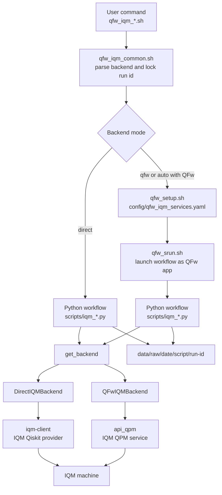

# QFw-IQM

QFw-IQM contains IQM-specific characterization workflows. The preferred path
runs through the Quantum Framework, where QFw owns service startup, placement,
and the reusable IQM QPM integration. The same Python workflows can also run
directly through `iqm-client` for standalone characterization without QFw.

## Requirements

For QFw-backed execution:

- A configured QFw tree with the IQM QPM service available.
- An activated QFw environment:

```bash
source /path/to/QFw/setup/qfw_activate
```

- IQM endpoint credentials exported in the shell that starts QFw:

```bash
export QFW_QC_URL="https://<iqm-endpoint>"
export QFW_API_KEY="<api-key>"
```

Optional IQM settings:

```bash
export QFW_IQM_QUANTUM_COMPUTER="<machine-name>"
export QFW_IQM_REQUEST_TIMEOUT=30
export QFW_IQM_JOB_TIMEOUT=300
```

For direct execution without QFw:

- The `iqm-client` Python package and its IQM dependencies.
- `QFW_QC_URL` and `QFW_API_KEY` exported in the shell.

## Workflows

Each workflow supports `--backend auto|qfw|direct`. The default is `auto`.
When QFw is activated, `auto` uses QFw. Otherwise, `auto` uses direct
`iqm-client` access.

In QFw mode, each wrapper starts QFw with `config/qfw_iqm_services.yaml`, runs
one Python script through `qfw_srun.sh`, and tears QFw down.

```bash
./qfw_iqm_env_check.sh --json
./qfw_iqm_discover.sh --json
./qfw_iqm_submit_smoke.sh --shots 100 --json
./qfw_iqm_timing_overhead.sh --shots-sweep 1,10,100 --batch-sweep 1,2 --json
./qfw_iqm_timing_1q.sh --qubits QB1,QB2 --gates rx,ry --depths 1,2,4 --json
```

To force direct mode:

```bash
./qfw_iqm_env_check.sh --backend direct --json
./qfw_iqm_discover.sh --backend direct --json
./qfw_iqm_submit_smoke.sh --backend direct --shots 100 --json
./qfw_iqm_timing_overhead.sh --backend direct --shots-sweep 1,10,100 --json
./qfw_iqm_timing_1q.sh --backend direct --qubits QB1 --gates rx --json
```

To run the current suite in one QFw session:

```bash
./qfw_iqm_run_all.sh
```

`qfw_iqm_run_all.sh` includes the environment check, discovery capture, smoke
submission, and a short single-qubit timing sanity sweep. The timing sweep is
kept intentionally small so that `run_all` remains safe for routine validation.
The default 1Q timing settings can be changed with:

```bash
export QFW_IQM_RUN_ALL_1Q_QUBITS=QB1
export QFW_IQM_RUN_ALL_1Q_GATES=rx
export QFW_IQM_RUN_ALL_1Q_DEPTHS=1,2
export QFW_IQM_RUN_ALL_1Q_SHOTS=100
export QFW_IQM_RUN_ALL_1Q_REPETITIONS=1
```

Larger timing campaigns should still be run explicitly with the desired shot
sweep, batch sweep, depth sweep, qubit list, and repetition count.

Output is written under:

```text
data/raw/<YYYYMMDD>/<script-name>/<HHMMSS>/
```

Each workflow writes its terminal summary to the run's `results/` directory.
With `--json`, the summary is stored in `results/stdout.json`. Without
`--json`, the text summary is stored in `results/stdout.txt`. The terminal only
prints the path to that saved output file.

The `data/` directory is intentionally ignored by git.

## Test Suite Design

The suite is split into three layers:

- Shell wrappers: `qfw_iqm_*.sh` files provide the user-facing commands.
- Python workflows: `scripts/iqm_*.py` files define each characterization test.
- Backend adapters: `scripts/qfw_iqm_util/backend_*.py` files hide whether the
  workflow talks to IQM through QFw or directly through `iqm-client`.

The goal is for each Python workflow to describe the test intent without
duplicating QFw startup code, IQM client setup, result-directory handling, or
timing parsing. New tests should normally add one shell wrapper and one Python
workflow, then use the shared helpers under `scripts/qfw_iqm_util/`.

The high-level flow is:



### Shell Wrapper Flow

Every top-level wrapper sources `qfw_iqm_common.sh` and calls `qfw_iqm_init`.
That common setup performs the suite-level decisions:

- It resolves the repository path and the QFw service config path.
- It parses `--backend auto|qfw|direct`.
- It parses `--run-id` if one was provided.
- It generates one UTC `HHMMSS` run id when the user did not provide one.
- It forwards the same run id to every Python workflow invocation.

The locked run id is important for long tests and suite runs. The output layout
uses `data/raw/<date>/<script>/<run-id>/`; without a locked run id, a workflow
that starts more than one Python process could create multiple sibling
timestamp directories.

For single-workflow commands, wrappers call:

```bash
qfw_iqm_run_single "scripts/<workflow>.py" "$@"
```

For suite-style commands, `qfw_iqm_run_all.sh` starts QFw once when needed and
then calls the Python workflows through `qfw_iqm_run_python_json` or
`qfw_iqm_run_qfw_json`.

### Backend Selection

All normal workflows support:

```text
--backend auto|qfw|direct
```

The default is `auto`. Backend selection is implemented in
`scripts/qfw_iqm_util/backend.py`:

- `auto` uses QFw when an activated QFw environment is visible and the DEFw/QPM
  Python modules can be imported.
- `auto` falls back to direct `iqm-client` access when QFw is not available.
- `qfw` requires QFw. If QFw is not activated, the workflow fails early.
- `direct` always uses direct `iqm-client` access and never starts QFw.

This means the same Python workflow can be used in three situations:

- QFw production path: QFw is activated and the IQM QPM service owns access to
  the device.
- Standalone characterization path: QFw is absent and the script talks directly
  to IQM.
- Debug path: the user forces either backend to compare QFw behavior against
  direct IQM behavior.

### Backend Interface

Both backend adapters expose the same workflow-facing operations:

- `get_backend_info()`
- `get_dynamic_backend_info(calibration_set_id=None)`
- `get_calibration_snapshot(calibration_set_id=None)`
- `get_coupling_graph(calibration_set_id=None)`
- `sync_run(info)`
- `sync_run_many(infos)`
- `run_circuits(circuits, shots=..., calibration_set_id=..., ...)`
- `finish(rc=0)`

Workflows should use these methods rather than importing QFw, DEFw, or
`iqm-client` directly. Metadata-only workflows use the metadata methods.
OpenQASM debugging workflows use `sync_run` or `sync_run_many`. Qiskit-authored
workflows use `run_circuits`.

### Direct Backend Structure

`DirectIQMBackend` lives in `scripts/qfw_iqm_util/backend_direct.py`. It is the
standalone implementation used when QFw is not involved.

It reads:

- `QFW_QC_URL`
- `QFW_API_KEY`
- optional `QFW_IQM_QUANTUM_COMPUTER`
- optional `QFW_IQM_REQUEST_TIMEOUT`
- optional `QFW_IQM_JOB_TIMEOUT`

For metadata operations, it calls the IQM client APIs directly and writes the
raw data into JSON-friendly structures. For Qiskit-authored circuits, it uses
IQM's Qiskit provider path. For lower-level `_qasm.py` workflows, it can build
native IQM circuit objects from the OpenQASM input and submit them through the
IQM client.

The direct backend is useful for early machine acceptance, service isolation,
and debugging. It should remain thin enough that it does not become a second
QFw implementation.

### QFw Backend Structure

`QFwIQMBackend` lives in `scripts/qfw_iqm_util/backend_qfw.py`. It adapts the
same workflow API to QFw.

When a workflow first needs the backend, it reserves an IQM QPM service through
`api_qpm` and DEFw:

```text
application -> api_qpm -> resource manager -> IQM QPM service
```

Metadata calls and `sync_run` calls are forwarded to that service. Qiskit
workflows create a QFw Qiskit backend with IQM backend type and
superconducting capability, then call `backend.run(...).result()`. The QFw
backend is responsible for routing the circuit request to the selected IQM QPM
service.

The QFw backend is the path that exercises the production integration:

```text
shell wrapper
  -> qfw_setup.sh with config/qfw_iqm_services.yaml
  -> qfw_srun.sh <Python workflow>
  -> QFwIQMBackend
  -> IQM QPM service
  -> IQM machine
```

### Workflow Categories

The suite intentionally contains more than one workflow style:

- Metadata workflows: `iqm_env_check.py` and `iqm_discover.py` query the
  backend and do not submit quantum jobs.
- Operational smoke workflows: `iqm_submit_smoke.py` submits a small
  Qiskit-authored circuit to confirm that execution and result retrieval work.
- Timing workflows: `iqm_timing_overhead.py` and `iqm_timing_1q.py` submit
  Qiskit-authored circuits and post-process timing telemetry.
- OpenQASM examples: `*_qasm.py` scripts are retained as lower-level debugging
  examples and are not the preferred path for new characterization tests.

The preferred direction is Qiskit-authored characterization workflows. The
QASM scripts are useful when testing native request handling, but they should
not be copied as the default pattern for new tests.

### Shared Output And Timing

`scripts/qfw_iqm_util/output.py` owns the output tree and JSON serialization.
`scripts/qfw_iqm_util/timing.py` converts IQM timeline events into duration
fields. `scripts/qfw_iqm_util/qiskit_exec.py` normalizes Qiskit results,
counts, job IDs, and backend timing metadata into a common result payload.

This keeps each workflow focused on the experiment design:

```text
parse arguments
create run paths
select backend
build circuits or query metadata
submit through the backend interface
write raw outputs
write summary and analysis files
finish backend cleanly
```

## Script Reference

The top-level Python files under `scripts/` are the workflow entry points.
They all support `--backend auto|qfw|direct`, `--output-dir`, `--run-id`,
and `--json`. Scripts that contact the machine also support
`--system-up-timeout`; scripts that query or submit against a specific
calibration can use `--calibration-set-id`.

### `scripts/iqm_env_check.py`

`iqm_env_check.py` is the first connectivity and metadata check. It selects
the requested backend, asks the backend for static and dynamic device
information, and writes a single `env_check.json` file. The output includes
the backend mode that was used, static architecture data, dynamic architecture
data, active qubits, the selected calibration set, and a compact summary for
quick terminal inspection.

Use this script before running characterization jobs. A successful run shows
that the local test environment can reach the IQM backend and that the backend
can return basic machine metadata. It does not submit a quantum job.

Typical use:

```bash
./qfw_iqm_env_check.sh --json
./qfw_iqm_env_check.sh --backend direct --json
```

### `scripts/iqm_discover.py`

`iqm_discover.py` captures the machine description needed for later
characterization and reporting. It collects backend metadata, dynamic
architecture metadata, the calibration snapshot, the quality metric snapshot,
and the coupling graph. The script writes `device_snapshot.json`,
`calibration_snapshot.json`, and `coupling_graph.json`.

The coupling graph is derived from the device architecture and dynamic gate
loci. This makes the output useful even when the provider API does not expose a
single direct `couplers` field. The script intentionally does not submit a
quantum job, and it no longer writes a qSchedSim skeleton file. Its job is to
record the raw discovery artifacts that other tools or reports can consume.

Typical use:

```bash
./qfw_iqm_discover.sh --json
./qfw_iqm_discover.sh --calibration-set-id <uuid> --json
```

### `scripts/iqm_submit_smoke.py`

`iqm_submit_smoke.py` is the preferred operational smoke test. It builds a
one-qubit Qiskit circuit, optionally applies an `X` gate with `--flip`, measures
the qubit, submits the circuit through the selected backend, and records the
result. The script writes the input description, a QASM artifact generated from
the Qiskit circuit, the backend result payload, and a timing summary when timing
metadata is available.

The default circuit measures the initial `|0>` state. With `--flip`, it
measures a prepared `|1>` state instead. This provides a minimal end-to-end
check that circuit construction, submission, execution, result retrieval, count
parsing, and timing propagation are working. It is not a fidelity benchmark.

Typical use:

```bash
./qfw_iqm_submit_smoke.sh --shots 100 --json
./qfw_iqm_submit_smoke.sh --shots 100 --flip --json
```

### `scripts/iqm_timing_overhead.py`

`iqm_timing_overhead.py` measures job-submission and execution timing using
Qiskit-authored measurement circuits. It runs two experiment families. The
shot sweep submits single circuits at different shot counts, while the batch
sweep submits multiple circuits in one backend call to expose batching behavior.
The script can repeat each case with `--repetitions` and can vary circuit width
with `--widths`.

For each record, the script writes the generated QASM artifact, the raw result
payload, and per-record timing metrics. It also writes
`timing_records.jsonl` and a `timing_summary.json` file with basic linear fits
for shot scaling and batch scaling where enough successful points exist. Use
`--dry-run` to verify the planned record set and output layout without
submitting jobs.

Typical use:

```bash
./qfw_iqm_timing_overhead.sh \
    --shots-sweep 1,10,100 \
    --batch-sweep 1,2 \
    --repetitions 3 \
    --json
```

### `scripts/iqm_timing_1q.py`

`iqm_timing_1q.py` implements the single-qubit gate duration test from the
characterization plan. It uses Qiskit to author one-qubit circuits, repeats a
selected gate at each requested depth, maps logical qubit 0 to the requested
physical IQM qubit, submits the serialized circuit through the common backend
path, and records timing data for each run.

The supported gate probes are `x`, `rx`, and `ry`. On IQM hardware these probe
the native PRX family through different Qiskit source gates and phases. The
default gate set is `rx,ry`, the default depth sweep is
`1,2,4,8,16,32,64,128`, and the default qubit set is `all` active qubits
reported by the backend. Use `--angle` to change the RX/RY angle, `--shots` to
set the shot count, and `--repetitions` to repeat each qubit/gate/depth point.

For each point, the script writes the generated QASM artifact, the raw result
payload, and a JSON-lines timing record. The post-processing step then writes
`results/analysis.json`, `results/analysis.md`, and plots under
`results/plots/`. The analysis explains whether IQM-reported execution time
per shot appears to increase linearly as repeated 1Q gate depth increases.

The primary hardware metric is `execution_per_shot_seconds`. It uses the IQM
timeline interval from `execution_started` to `execution_ended`, divided by the
shot count. Wall-time fields such as `script_wall_seconds`,
`client_total_seconds`, and `server_total_seconds` are recorded only as
diagnostics because they include client, service, queueing, and orchestration
overhead.

The generated plots show depth on the x-axis and IQM execution time per shot on
the y-axis. The default plot set includes one plot per gate across all selected
physical qubits, one plot per physical qubit across all selected gates,
fit-residual plots per gate, and a heatmap of fitted slope by gate and qubit.
If `matplotlib` is not installed, the script still completes and records that
plot generation was skipped in the analysis files.

Typical use:

```bash
./qfw_iqm_timing_1q.sh \
    --qubits QB1,QB2 \
    --gates rx,ry \
    --depths 1,2,4,8,16 \
    --shots 100 \
    --repetitions 3 \
    --json
```

### `scripts/iqm_submit_smoke_qasm.py`

`iqm_submit_smoke_qasm.py` is a lower-level version of the smoke test that
constructs OpenQASM directly instead of authoring the circuit with Qiskit. It
submits a one-qubit measurement circuit through the selected backend using the
backend `sync_run` path. It supports `--flip`, `--shots`, `--qubit`,
`--calibration-set-id`, `--timeout`, and `--use-timeslot`.

This script is kept as an explicit OpenQASM example and as a debugging path for
the native request format. New characterization tests should usually prefer
`iqm_submit_smoke.py` so that circuit construction goes through Qiskit.

Typical use:

```bash
python3 scripts/iqm_submit_smoke_qasm.py --backend direct --shots 100 --json
```

### `scripts/iqm_timing_overhead_qasm.py`

`iqm_timing_overhead_qasm.py` is the direct-OpenQASM counterpart to
`iqm_timing_overhead.py`. It builds measurement circuits as QASM strings,
submits them through `sync_run` or `sync_run_many`, and records the same style
of per-job timing output and summary fits. It supports the same timing sweep
controls as the Qiskit timing script, plus `--qubit` for one-qubit mapped runs.

This script is useful when the native OpenQASM request path itself needs to be
debugged or compared against the Qiskit-authored workflow. For general timing
campaigns, use `iqm_timing_overhead.py`.

Typical use:

```bash
python3 scripts/iqm_timing_overhead_qasm.py \
    --backend direct \
    --shots-sweep 1,10,100 \
    --batch-sweep 1,2 \
    --json
```

## Helper Modules

The `scripts/qfw_iqm_util/` package contains shared implementation code used
by the workflow scripts. These files are not meant to be run directly.

| Module | Role |
| --- | --- |
| `backend.py` | Parses the common `--backend` option and selects QFw or direct IQM execution. |
| `backend_direct.py` | Implements direct `iqm-client` access, metadata queries, direct circuit submission, timing extraction, and coupling graph construction. |
| `backend_qfw.py` | Adapts the workflows to the QFw IQM service and QFw Qiskit backend. |
| `output.py` | Creates the `data/raw/<date>/<script>/<run>/` directory layout and writes JSON artifacts. |
| `qfw.py` | Reserves the IQM QPM service and exits the QFw application cleanly. |
| `qiskit_exec.py` | Contains shared Qiskit execution helpers, QASM artifact writing, count extraction, and timing summary propagation. |
| `timing.py` | Converts IQM job timeline events into duration fields used by smoke and timing reports. |

## QFw Execution Model

The shell wrappers assume QFw is responsible for startup, service placement,
and teardown when `--backend qfw` is selected or `--backend auto` detects an
activated QFw shell. The Python scripts run as QFw applications and use
`api_qpm` to reserve the IQM QPM service.

The default service config starts one IQM QPM on group 1:

```bash
qfw_setup.sh --services-config config/qfw_iqm_services.yaml
qfw_srun.sh scripts/iqm_submit_smoke.py
qfw_teardown.sh
```

For a heterogeneous allocation, the application runs on group 0 and the IQM
QPM service runs on the group 1 head node. For local or single-node operation,
QFw's allocation abstraction can map both groups to the same node.

## Direct Execution Model

In direct mode, the shell wrappers do not call `qfw_setup.sh`, `qfw_srun.sh`,
or `qfw_teardown.sh`. They execute the Python workflow locally and use
`iqm-client` with `QFW_QC_URL` and `QFW_API_KEY`. This mode is useful for
early machine characterization and for sharing the scripts with users who do
not have QFw installed.

## Adding Workflows

New shell wrappers should source `qfw_iqm_common.sh` rather than reimplement
backend parsing or QFw startup. A minimal wrapper looks like:

```bash
#!/usr/bin/env bash
set -euo pipefail

repo_dir="$(cd "$(dirname "${BASH_SOURCE[0]}")" && pwd)"
source "${repo_dir}/qfw_iqm_common.sh"

qfw_iqm_init "$@"
qfw_iqm_run_single "scripts/new_workflow.py" "$@"
```

The Python script should add the common backend option with
`add_backend_argument(parser)` and construct the backend with
`get_backend(args.backend, args.system_up_timeout)`.

The `_qasm.py` scripts are retained as lower-level examples that build
OpenQASM directly. Characterization workflows should prefer Qiskit-authored
circuits unless they are explicitly testing OpenQASM handling.
